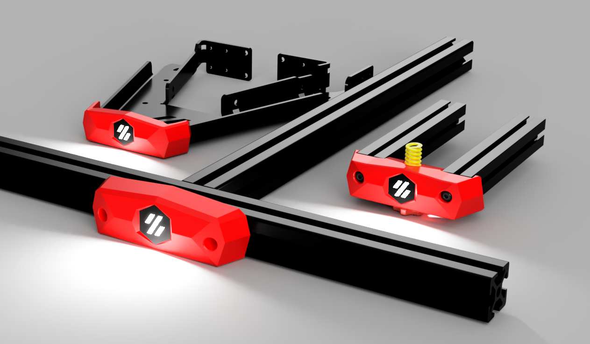

# Stealth Bed Front

A "low-poly" front bumper for the Voron V0 and Trident Beds featuring a stealthburner-inspired RGB LED Logo

Compatible with the stock V0 bed *and* the popular [V0 Kirigami Bed](https://github.com/christophmuellerorg/voron_0_kirigami_bed).

# Printing

 - Use standard Voron print settings for all parts
 - Use a clear or white filament for `[c]_diffuser.stl`
 - Use a dark filament for `[o]_logo_insert.stl` and `[o]_led_holder.stl`
 - For VO, print `[a]_main_body_stock.stl` *or* `[a]_main_body_kirigami.stl` if you are using the kirigami bed frame.

 # Assembly

