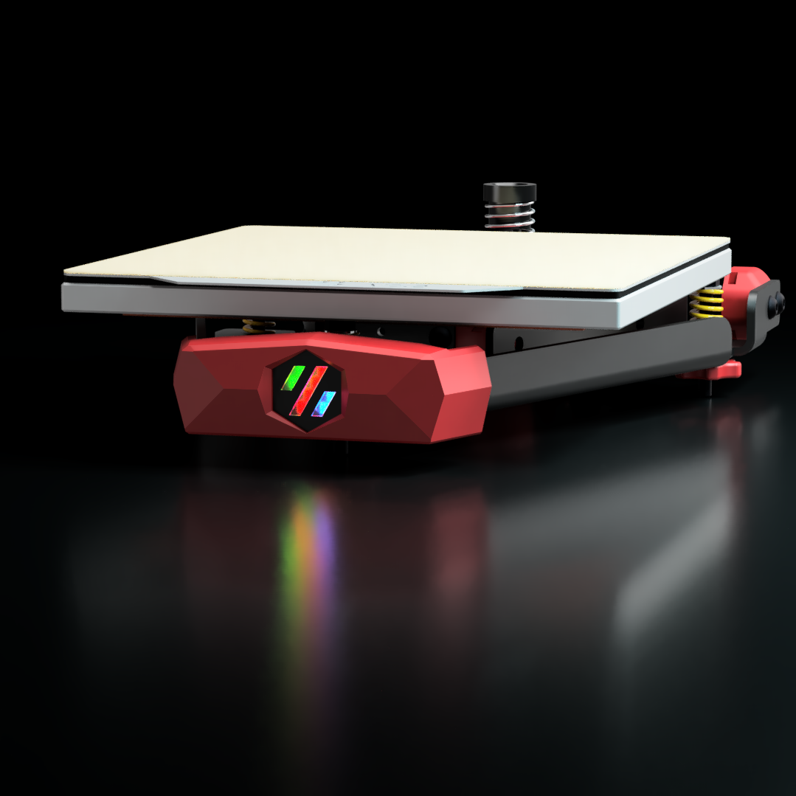

# Stealth Bed Front

A "low-poly" front for the [Kirigami](https://github.com/christophmuellerorg/voron_0_kirigami_bed/) bed for the Voron V0 featuring a stealthburner-inspired RGB LED Logo

# Printing

 - Use standard Voron print settings for all parts
 - Use a clear or white filament for `[c]_diffuser.stl`
 - Use a dark filament for `[o]_logo_insert.stl` and `[o]_led_holder.stl`

 # Assembly

